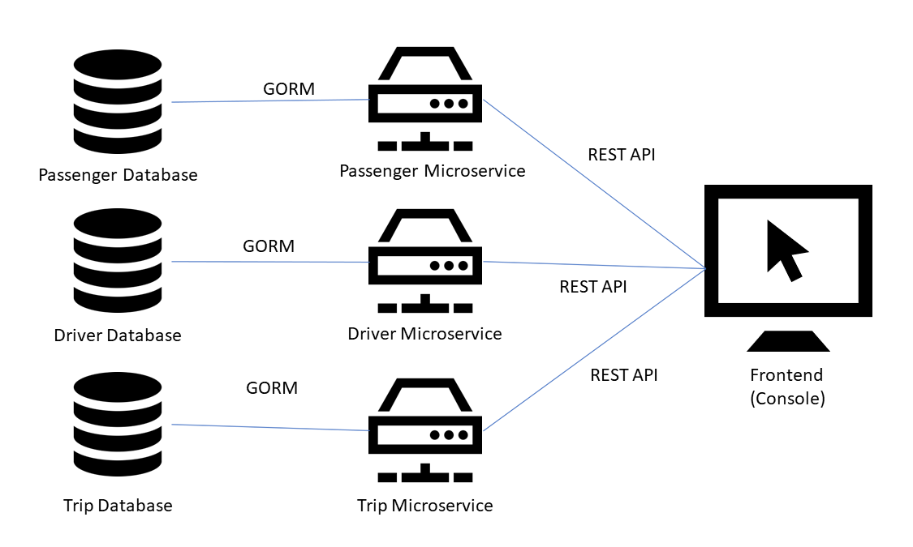

_This project was made for Assignment 1 of Ngee Ann Polytechnic's Emerging Trends in IT module._ 

# HytchHyke

## Microservice Architecture Design



## Microservice Design Considerations

For my backend, I decided to split it into 3 different microservices: `passenger`, `driver` and `trip`. 

The first consideration was that microservices are supposed to only have a single responsibility. in this case, each microservice would be responsible for Creating, Reading, Updating and Deleting (CRUD) their respective data type from their databases. 

> For example, the `passenger` microservice would only be responsible for CRUD for passengers. 

The second consideration was that microservices have to be loosely coupled. In fact, all of HytchHyke's microservices are completely decoupled from each other, and there is 0 dependency between the microservices. This is because there is minimal logic handled in the microservices; The microservices only handle simple CRUD functionality. The rest of the logic is handled in the front end, which allows the front end developers more control over the functionality they would like to achieve.

> This allows for maximum maintainability, as only the frontend would need to be updated if any of the microservices are changed! 

The third consideration was that the microservices should be easily testable, meaning minimizing on side effects within the code which makes testing extremely difficult. Thus, none of HytchHyke's microservice functions contain any unknown side effects. Each function performs what it is clearly stated to do, and nothing more.

## Backend Set Up
Please refer to the `backend/README.md` file.

## Frontend Set up
> Note: Make sure backend is running!

cd into `console` using
```
cd console
```

Run the console by running:
```
go run main.go
```
